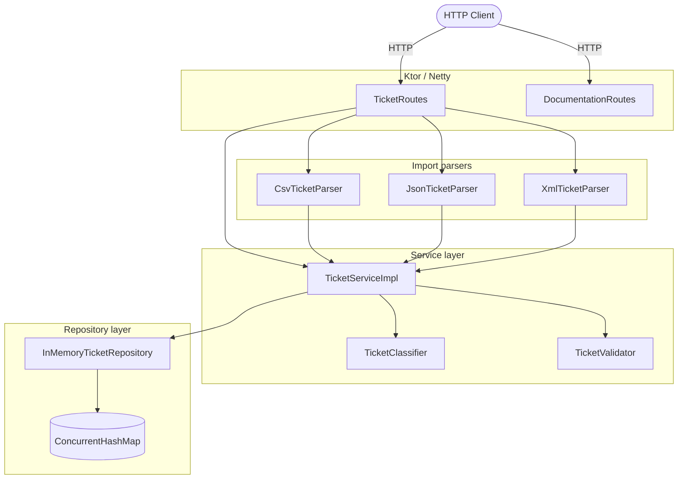
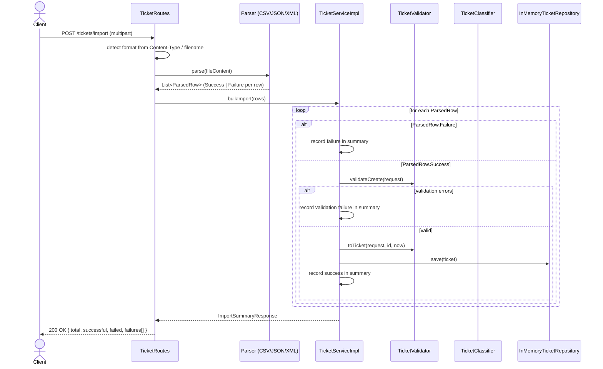
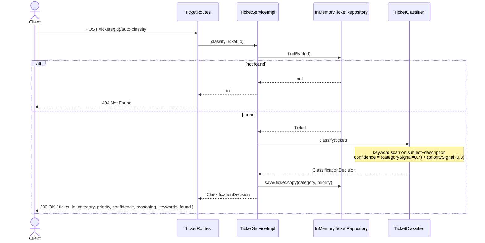

# Architecture — Customer Support Ticket System

## Component overview

### Package map

| Package | Responsibility |
|---|---|
| `homework2.entrypoint` | Ktor server bootstrap and application module wiring |
| `homework2.routing` | Route handlers — HTTP in, HTTP out; no business logic |
| `homework2.service` | `TicketServiceImpl`, `TicketClassifier`, `InMemoryTicketRepository` |
| `homework2.models` | Data classes, enums, request/response shapes |
| `homework2.validation` | `TicketValidator` — pure validation, no I/O |
| `homework2.utils.parsers` | Format-specific parsers returning `ParsedRow` results |

---

## Bulk import sequence

The sequence below shows what happens from the moment `POST /tickets/import` arrives until the response is sent.

---

## Auto-classify sequence

---

## Key design decisions

**In-memory repository with `ConcurrentHashMap`** — sufficient for a coursework API. All reads and writes are thread-safe without external locking. Persistence across restarts is out of scope; the design can be replaced with a database-backed implementation by swapping the `TicketRepository` binding in `ApplicationModule`.

**`ParsedRow` sealed class** — parsers never throw; every row produces either a `ParsedRow.Success` (holds a `CreateTicketRequest`) or a `ParsedRow.Failure` (holds a row number, error message, and optional raw string). This allows partial import success and clean summary reporting without exception-based control flow.

**`TicketValidator` as a pure function object** — no state, no I/O. It accepts a request and returns a list of `ValidationError`. The same validator is used by the direct-create endpoint and by `bulkImport`, ensuring consistent rules across both paths.

**`TicketClassifier` with an internal decision log** — the log is in-memory only and has no public HTTP endpoint. It exists to support internal inspection during testing and could be exposed as an admin endpoint without changing the classifier itself.

**Format detection order** — the import route prefers the `Content-Type` header of the file part; if absent, it falls back to the filename extension. This means a file named `export.csv` sent without an explicit part content-type still works correctly, which matches real-world client behaviour (e.g. `curl -F 'file=@export.csv'`).
