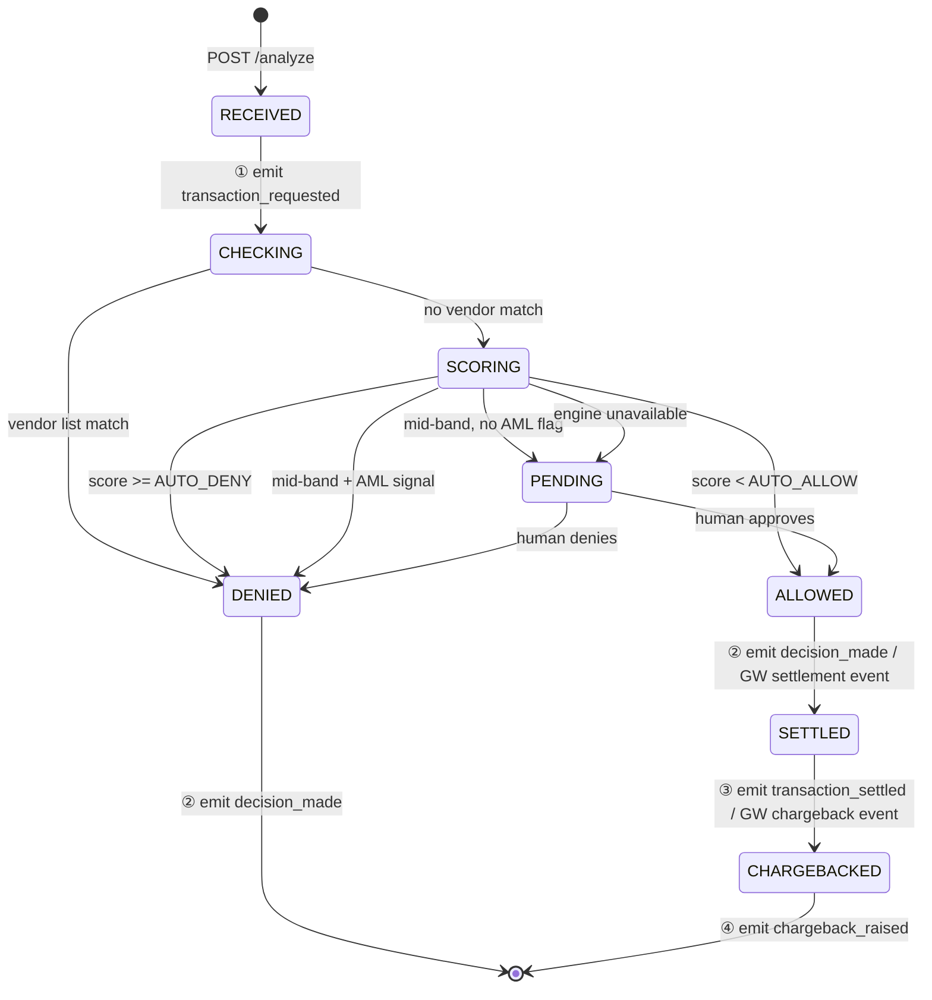

# Real-Time Antifraud (RTAF) System Specification

> Ingest the information from this file, implement the Low-Level Tasks, and generate the artifacts that will satisfy the High-Level and Mid-Level Objectives.

---

## 1. High-Level Objective

Build a real-time antifraud service (RTAF) that intercepts incoming payment transactions on behalf of an existing Payment Gateway, delivers a low-latency `ALLOW / DENY / PENDING` verdict by combining external vendor block-lists, a self-learning fraud engine score, and configurable rule thresholds, and continuously feeds transaction lifecycle events back to the fraud engine for model improvement — while keeping all card-holder data strictly within PCI-DSS boundaries and ensuring end users receive only generic, non-revealing decline messages.

**Scope boundary:** RTAF is a decision and event-routing layer only. It does not process payments, manage card accounts, store card credentials, implement the fraud engine's learning algorithms, or operate a human review UI.

---

## 2. Out of Scope

The following are explicitly excluded from this specification:

- Implementation of the Payment Gateway (GW is a pre-existing system; only the RTAF-facing contract changes required of GW are specified here)
- Implementation or internals of the Self-Learning Fraud Engine (treated as a black-box dependency with a defined API contract)
- Full AML/KYC compliance programme — only velocity-check signals and watchlist-match flags are included as lightweight scoring inputs; SAR filing, onboarding KYC, and ongoing monitoring workflows are out of scope
- Human review operator UI — this spec covers the queue producer contract and SLA; the tooling used by ops to drain the queue is out of scope
- Card scheme rules, dispute resolution workflows, and chargeback adjudication beyond forwarding the chargeback event to the fraud engine
- Fraud engine model training, feature engineering, and retraining pipelines

---

## 3. Stakeholders

| Stakeholder | Needs to observe | Needs to control |
|---|---|---|
| **End User** | Generic decline message from GW — no fraud signal detail, no `denial_reason`, no case reference | Nothing — read-only consumer of GW response |
| **Ops** | Real-time decision throughput, human review queue depth and age, vendor list cache staleness, per-tier error rates, SLO breach alerts | Queue drain and case resolution; vendor sync schedule and TTL config; tier score threshold parameters |
| **Compliance** | Full immutable audit log per transaction (verdict, `denial_reason`, score, rule path, timestamps, actor); GDPR data retention state; PCI zone boundary integrity | Retention policy parameters; right-to-explanation response templates; permission to trigger compliance-only log exports |
| **Support** | Internal `denial_reason` for a specific transaction by transaction ID lookup (read-only, PAN-redacted view); `PENDING` case status and age | Read-only lookup only — cannot modify decisions, reason codes, queue state, or audit records |

---

## 4. System Context

RTAF sits between four actors:

**Payment Gateway (GW)** calls RTAF synchronously with `POST /analyze` for every incoming transaction. RTAF responds with one of three verdict states: `ALLOW`, `DENY` (accompanied by an internal `denial_reason` enum value and a coarse `user_facing_category` enum), or `PENDING` (accompanied by an opaque `case_id`). The GW stores `denial_reason` in its own internal audit log and maps `user_facing_category` to a single static generic string that it displays to the end user. The GW never forwards `denial_reason` to any client-facing surface.

**End User** interacts only with the GW. They receive a generic decline message when a transaction is denied or pending. They never see `denial_reason`, risk scores, rule flags, or case identifiers.

**Self-Learning Fraud Engine** is queried by RTAF for a risk score during transaction analysis. It also receives four lifecycle events from RTAF — `transaction_requested`, `decision_made`, `transaction_settled`, `chargeback_raised` — which it uses to improve its scoring model. The fraud engine is treated as a black-box dependency with a defined request/response contract.

**External Vendor Feed** provides known-bad entity lists (cards, accounts, device fingerprints, IP ranges) via scheduled batch sync. These lists power RTAF's hard-block tier. The vendor feed is in scope because the hard-block tier cannot be specified without it; RTAF does not implement the vendor's side of the sync.

---

## 4.1. Transaction Lifecycle

The diagram below shows the full state machine a transaction passes through from the moment RTAF receives it until the post-payment lifecycle events are complete. States represent stable waiting points; transitions carry the decision guard and the fraud-engine event emitted at that point (①–④).

**State legend:**

| State | Description |
|---|---|
| `RECEIVED` | Valid `POST /analyze` accepted; `transaction_requested` emitted to fraud engine before any decision |
| `CHECKING` | Hard-block lookup against vendor list cache — in-memory, no fraud engine call |
| `SCORING` | Fraud engine scoring call in flight; AML velocity and watchlist signals collected and passed as features |
| `PENDING` | Mid-confidence case enqueued for human review; GW receives `PENDING` + opaque `case_id` immediately |
| `ALLOWED` | Verdict finalised: allow — auto (from `SCORING`) or review-approved (from `PENDING`) |
| `DENIED` | Verdict finalised: deny — vendor-blocked, score-based, AML-flagged, or review-denied |
| `SETTLED` | GW reports payment network confirmed settlement; lifecycle continues for fraud engine learning |
| `CHARGEBACKED` | GW reports dispute raised; terminal state for the full transaction lifecycle |

**`denial_reason` per path into `DENIED`:**

| Transition | `denial_reason` |
|---|---|
| `CHECKING → DENIED` | `VENDOR_BLOCKLIST` |
| `SCORING → DENIED` (score above threshold) | `HIGH_FRAUD_SCORE` |
| `SCORING → DENIED` (mid-band + velocity) | `VELOCITY_LIMIT_EXCEEDED` |
| `SCORING → DENIED` (mid-band + watchlist) | `AML_FLAG` |
| `SCORING → PENDING` (mid-band, no AML) | `LOW_CONFIDENCE_PENDING` |
| `SCORING → PENDING` (engine unavailable) | `FRAUD_ENGINE_UNAVAILABLE` |
| `PENDING → DENIED` (human denies) | `LOW_CONFIDENCE_PENDING` (original reason retained) |

**Notes:**
- `DENIED` is a terminal state — a denied transaction never proceeds to `SETTLED` or `CHARGEBACKED`.
- `CHECKING` and `SCORING` are transient processing states; they are included explicitly because each carries a distinct latency budget (see §13).
- `decision_made` (②) is emitted once per transaction on the first terminal verdict — whether `ALLOWED`, `DENIED`, or `PENDING`. When a `PENDING` case is resolved by a human reviewer, a second `decision_made` event is emitted with the final verdict.
- `transaction_settled` (③) and `chargeback_raised` (④) are driven by inbound GW lifecycle events, not by RTAF decisions.

---

## 5. Mid-Level Objectives

| # | Objective | Observable outcome when met |
|---|---|---|
| O1 | Transaction analysis pipeline processes a request end-to-end within the stated latency SLO | GW receives a verdict within the p99 budget for the applicable decision tier |
| O2 | Vendor hard-block tier intercepts known-bad transactions before the fraud engine is called | Blocked transactions never appear in the fraud engine's query log |
| O3 | Score-based auto-decision operates without human involvement for high-confidence cases | Decision log records rule path and score for every auto-allow and auto-deny |
| O4 | Human review queue receives mid-confidence cases and drains within the stated SLA | Queue depth and time-to-resolution metrics are continuously tracked |
| O5 | All four lifecycle events are emitted to the fraud engine reliably and in order | Event audit log entries match the transaction lifecycle 1:1 with no gaps |
| O6 | Vendor lists are refreshed on schedule with staleness protection | Cache age metric remains within the configured TTL bound; staleness alerts fire on breach |
| O7 | System operates within stated compliance boundaries at all times | No PCI-sensitive data appears in logs, event payloads, or queue messages |
| O8 | Every `DENY` verdict carries an internal enumerated reason fully traceable by ops and support | Each denied transaction has a non-null `denial_reason` in the internal audit log |
| O9 | GW surfaces only generic, non-revealing decline messages to the end user | User-facing message contains no signal that could enable a fraudster to adapt their pattern |

---

## 6. Permission Boundaries

| Resource | Who can read | Who can write / modify | Key constraint |
|---|---|---|---|
| `denial_reason` field | GW internal systems; Ops; Support (per-txn lookup, PAN-redacted); Compliance | RTAF only — set at decision time, immutable thereafter | Must never appear in any client-facing API response, external log shipment, or forwarded event payload |
| `user_facing_category` → message mapping | GW application code; Compliance | GW engineering with Compliance sign-off | Mapping changes require compliance review; unknown `denial_reason` values fall back silently to `SECURITY_DECLINE` |
| Human review queue | Ops (read + resolve); RTAF (enqueue) | RTAF (produce); Ops (resolve via internal webhook) | Support has no queue access; end users have no visibility of case existence |
| Audit log | Compliance (full); Ops (operational fields); Support (per-txn, redacted) | Append-only by RTAF — no modification or deletion by any role | Retention-driven deletion executed only by the automated GDPR compliance job |
| Fraud engine event stream | Fraud Engine (consume); RTAF (produce) | RTAF only | `denial_reason` must be scrubbed from every event payload before forwarding; only `verdict` and `user_facing_category` are permitted |
| Vendor list cache | RTAF (read at runtime) | Vendor sync job only | No manual override; staleness triggers alert, not emergency write |

---

## 7. Non-Functional Requirements & Policy

### 7.1 Latency

See Section 13 for full targets. All figures are assumed targets justified against industry norms; they are not benchmarked results.

The gateway SLO covers only the synchronous response path (hard-block and score-based tiers). The `PENDING` enqueue path is fire-and-forget from the gateway's perspective and is excluded from the synchronous SLO.

### 7.2 Throughput

RTAF must sustain **100–1 000 TPS** at steady state with headroom for 2× burst (up to 2 000 TPS for up to 60 seconds). The system must degrade gracefully under load: shed non-critical enrichment steps before shedding the core decision path.

### 7.3 Availability

Target: **99.95% monthly uptime** for the synchronous `/analyze` endpoint (≈ 22 minutes downtime per month), consistent with payment-critical services.

Degraded-mode behaviour:
- Fraud engine unavailable → fail-closed: return `PENDING`, enqueue for human review
- Vendor list cache stale beyond TTL → serve stale list with staleness flag; alert ops; do not block transactions solely on staleness
- Message broker unavailable → buffer events locally (bounded in-memory queue); flush on reconnect; alert ops if buffer exceeds threshold

### 7.4 PCI-DSS

- PAN, CVV, and full magnetic stripe data must never leave the encrypted PCI zone
- No PAN-derived value (truncated or hashed PAN excepted where required for dedup) may appear in any log line, event payload, queue message, or audit record
- The PCI masking layer (T12) is applied to all outbound data paths before emission
- Encryption at rest and in transit required for all stores touching card data

### 7.5 GDPR

- Event payloads to the fraud engine contain only the minimum data necessary for scoring (no full name, no address, no PAN)
- Transaction records in the audit log are subject to a defined retention period (see T14); automated deletion after expiry
- Right-to-explanation requests are satisfied via a compliance-reviewed generic template, not by disclosing `denial_reason` or score values to the data subject

### 7.6 AML / KYC (minimal)

- RTAF collects two lightweight AML signals as scoring inputs: **velocity check** (transaction count and volume per account over rolling windows) and **watchlist match** (account/entity appears on a configured sanctions or watch list)
- These signals are fed as boolean/count features to the fraud engine scoring call
- No SAR filing, no full KYC programme, no ongoing monitoring pipeline is in scope

### 7.7 Audit Trail

- Every decision event is written to an append-only, tamper-evident audit log
- Each audit record contains: transaction ID, timestamp (ISO 8601, UTC), verdict, `denial_reason`, fraud engine score, rule path taken, actor (RTAF service instance ID), and a masked payload snapshot
- No record may be modified or deleted by any application role; deletion is permitted only by the automated GDPR retention job

---

## 8. Implementation Notes

**Idempotency.** `POST /analyze` must accept an idempotency key supplied by the GW. Repeated calls with the same key return the cached decision without re-running analysis or emitting new events.

**Money representation.** All monetary amounts are represented as `Decimal` / fixed-point integers (minor currency units). Floating-point types are prohibited for any monetary field at every layer.

**Error semantics — fraud engine unavailable.** If the fraud engine returns a timeout or 5xx, RTAF must fail closed: return `PENDING` with a `case_id`, enqueue the transaction for human review, and emit a `decision_made` event with `denial_reason = PENDING_REVIEW`. Auto-allow on upstream failure is prohibited.

**Vendor list cache.** The cache is populated by a scheduled batch sync job. At runtime, RTAF reads only from the cache (no inline vendor API calls). If the cache is stale beyond TTL, RTAF serves the last known list, sets a staleness flag in the audit record, and raises an ops alert. Transactions are not auto-blocked or auto-allowed solely because of list staleness.

**Event delivery guarantee.** Events are published with at-least-once semantics. The fraud engine must implement consumer-side deduplication using the transaction ID as the dedup key.

**Correlation and PAN isolation.** All cross-service references use an opaque internal transaction reference ID. No correlation ID may be constructed from or contain any PAN-derived value.

**PENDING response contract.** A `PENDING` response includes an opaque `case_id` (UUID). The GW may poll `GET /cases/{case_id}/status` or receive a webhook callback when the human reviewer resolves the case.

**Denial reason contract.** `AnalyzeResponse` carries two denial-related fields:

- `denial_reason` — internal enum, owned by RTAF. Values: `VENDOR_BLOCKLIST`, `HIGH_FRAUD_SCORE`, `LOW_CONFIDENCE_PENDING`, `VELOCITY_LIMIT_EXCEEDED`, `AML_FLAG`, `FRAUD_ENGINE_UNAVAILABLE`. This field is for GW-internal audit and ops use only. It must never appear in any client-facing payload.
- `user_facing_category` — coarse enum, mapping owned by GW. Values: `SECURITY_DECLINE`, `TEMPORARY_UNAVAILABLE`. GW maps each category to a single static generic string (e.g. "This transaction could not be completed. Please contact your bank." for `SECURITY_DECLINE`).

**User-facing message rule.** One static string per `user_facing_category`. The string must not vary by sub-reason. If GW receives an unknown `denial_reason` value (future enum addition), it silently maps to `SECURITY_DECLINE` and raises an ops alert to update the mapping. No exception is propagated to the user.

**Enum versioning.** RTAF owns the `denial_reason` enum. GW must handle unknown values gracefully. Adding a new `denial_reason` value is a non-breaking change for GW provided the fallback rule above is implemented.

---

## 9. Context

### Beginning Context

The following exist before RTAF is built:

- Payment Gateway with outbound HTTP API capability and support for webhook callbacks
- Self-Learning Fraud Engine exposing: `POST /score` (synchronous, returns risk score 0–100) and `POST /events` (asynchronous event ingestion)
- External Vendor Feed providing known-bad entity lists via HTTPS batch download or SFTP export on a configurable schedule
- Infrastructure: message broker (e.g. Kafka or RabbitMQ), secrets store (e.g. Vault), structured log sink (e.g. Elasticsearch or Splunk), relational or document store for audit records

### Ending Context

After RTAF is operational:

- RTAF service deployed with `POST /analyze` and `GET /cases/{case_id}/status` endpoints live
- Vendor sync job running on schedule; cache populated and TTL-governed
- Human review queue populated and drained via ops tooling; resolution webhook configured
- Event stream flowing to fraud engine on all four lifecycle hooks
- Audit log persisted and queryable; PCI masking applied to all records
- GW updated to consume new `denial_reason` and `user_facing_category` fields; generic user messages rendered correctly; GW internal audit log extended

---

## 10. Low-Level Tasks

Each task follows this shape:

> **Prompt** — what to instruct an AI agent to implement
> **Target file / component** — specific file path or service component
> **Details** — requirements, constraints, data shapes, rules
> **Acceptance criteria** — checkable definition of done

---

### T1 — Define AnalyzeRequest / AnalyzeResponse data contracts

**Prompt:**
Define the complete request and response data contracts for the `POST /analyze` endpoint, including all verdict states, the `denial_reason` internal enum, the `user_facing_category` coarse enum, the `case_id` field for `PENDING` responses, and the idempotency key header.

**Target file / component:**
`rtaf-service/src/main/kotlin/contracts/AnalyzeContracts.kt` (or equivalent schema file `api/analyze-schema.json`)

**Details:**

Request fields:
- `idempotency_key` (header, UUID, required) — GW-supplied; used for dedup
- `transaction_id` (UUID, required) — opaque internal reference
- `amount` (long, minor currency units, required)
- `currency` (ISO 4217, required)
- `merchant_id` (string, required)
- `account_id` (string, required) — hashed or tokenised; no raw PAN
- `device_fingerprint` (string, optional)
- `ip_address` (string, optional)
- `timestamp` (ISO 8601 UTC, required)

Response fields (common):
- `verdict` (enum: `ALLOW`, `DENY`, `PENDING`, required)
- `transaction_id` (UUID, echoed)

Response fields (DENY only):
- `denial_reason` (enum: `VENDOR_BLOCKLIST`, `HIGH_FRAUD_SCORE`, `LOW_CONFIDENCE_PENDING`, `VELOCITY_LIMIT_EXCEEDED`, `AML_FLAG`, `FRAUD_ENGINE_UNAVAILABLE`, required when verdict = `DENY`)
- `user_facing_category` (enum: `SECURITY_DECLINE`, `TEMPORARY_UNAVAILABLE`, required when verdict = `DENY`)

Response fields (PENDING only):
- `case_id` (UUID, required when verdict = `PENDING`)
- `user_facing_category` (always `TEMPORARY_UNAVAILABLE` for `PENDING`)

Money rule: `amount` is long (minor units); no float fields anywhere in contract.

**Acceptance criteria:**
- Contract covers all three verdict states with correct required/optional fields
- `denial_reason` enum contains exactly the six values listed above; no others
- `user_facing_category` enum contains exactly two values: `SECURITY_DECLINE`, `TEMPORARY_UNAVAILABLE`
- `PENDING` response always includes `case_id` and never includes `denial_reason`
- `DENY` response always includes both `denial_reason` and `user_facing_category`
- No PAN, CVV, or full card number field appears anywhere in the contract
- Contract is versioned (`v1`) and backward-compatible extension rules are documented

---

### T2 — Decision contract + GW mapping group

**Prompt:**
(a) Define the full `denial_reason` taxonomy specifying which decision tier produces each value and under what condition. (b) Define the `user_facing_category` → generic user message mapping owned by GW, including the leakage-prevention rule and the unknown-value fallback. (c) Specify the GW contract changes: new response fields to consume, message rendering rules, GW internal audit log extension for `denial_reason`.

**Target file / component:**
(a) `docs/denial-reason-taxonomy.md`
(b) `gateway-integration/docs/user-message-mapping.md`
(c) `gateway-integration/docs/gw-contract-changes.md`

**Details:**

(a) Denial reason taxonomy:

| Value | Producing tier | Trigger condition |
|---|---|---|
| `VENDOR_BLOCKLIST` | Hard-block | Account, card token, device fingerprint, or IP matches vendor list |
| `HIGH_FRAUD_SCORE` | Score tier | Fraud engine score ≥ auto-deny threshold |
| `LOW_CONFIDENCE_PENDING` | Score tier | Fraud engine score falls within the mid-band review range |
| `VELOCITY_LIMIT_EXCEEDED` | Score tier (AML signal) | Transaction count or volume exceeds configured rolling-window threshold |
| `AML_FLAG` | Score tier (AML signal) | Account or counterparty matches watchlist |
| `FRAUD_ENGINE_UNAVAILABLE` | Score tier (fallback) | Fraud engine timeout or 5xx; fail-closed path |

`PENDING_REVIEW` is used internally in queue messages and events but is never returned in `AnalyzeResponse`; the response verdict `PENDING` implicitly carries this meaning.

(b) GW user message mapping:

| `user_facing_category` | Generic user-facing string |
|---|---|
| `SECURITY_DECLINE` | "This transaction could not be completed. Please contact your bank if you believe this is an error." |
| `TEMPORARY_UNAVAILABLE` | "We are unable to process your transaction at this time. Please try again later." |

Rules:
- One static string per category; no interpolation, no sub-reason variation
- If GW receives an unknown `denial_reason`, map silently to `SECURITY_DECLINE`; raise ops alert `UNKNOWN_DENIAL_REASON`; do not propagate exception to user
- `denial_reason` must never appear in any HTTP response body, header, or error payload returned to the end user or to any public API consumer

(c) GW contract changes:
- Consume `denial_reason` from RTAF response; store in GW-internal transaction record and audit log
- Consume `user_facing_category`; render as static string per mapping above
- Consume `case_id` on `PENDING`; store; expose only to ops via internal lookup; do not return to end user
- Extend GW internal audit log schema with fields: `rtaf_verdict`, `rtaf_denial_reason`, `rtaf_case_id`, `rtaf_response_time_ms`
- GW must never forward `denial_reason` downstream

**Acceptance criteria:**
- All six `denial_reason` values have a documented producing tier and trigger condition
- Every `denial_reason` maps to exactly one `user_facing_category`
- Unknown `denial_reason` values trigger silent fallback to `SECURITY_DECLINE` plus ops alert, with no user-visible error
- GW audit log extension captures all four new RTAF fields
- No test or staging environment returns `denial_reason` in any client-facing response body
- Message strings contain no reference to fraud, suspicion, or specific rule triggers

---

### T3 — Vendor list cache loader

**Prompt:**
Implement the vendor list cache loader: scheduled batch sync from the external vendor feed, TTL management, staleness detection, and atomic swap on refresh.

**Target file / component:**
`rtaf-service/src/main/kotlin/vendor/VendorListCacheLoader.kt`

**Details:**
- Sync schedule: configurable cron (default: every 15 minutes)
- Vendor feed: HTTPS batch download or SFTP export; URL and credentials from secrets store
- Cache structure: in-memory hash sets per entity type (card token, account ID, device fingerprint, IP range); indexed for O(1) lookup
- TTL: configurable (default: 60 minutes); if cache age exceeds TTL and sync has not succeeded, set `cache_stale = true` flag and raise ops alert
- Atomic swap: new list is fully loaded into a staging structure before replacing the live cache; no partial-list state is visible to the lookup path
- Staleness behaviour: serve last known list with staleness flag; do not block transactions solely because list is stale
- Metrics: emit `vendor_list_age_seconds`, `vendor_list_size`, `vendor_list_sync_duration_ms`, `vendor_list_sync_error_count`

**Acceptance criteria:**
- Cache is populated on service startup before first request is served
- Atomic swap: no transaction is evaluated against a partially loaded list
- Staleness alert fires within one sync cycle of TTL breach
- `cache_stale` flag is present in the audit record for any transaction evaluated against a stale list
- Sync failures are retried with exponential backoff (max 3 retries before alerting)
- Cache contents are never logged (vendor list is security-sensitive)

---

### T4 — Hard-block lookup

**Prompt:**
Implement the hard-block lookup component that checks incoming transaction attributes against the vendor list cache and returns a `DENY` decision with `denial_reason = VENDOR_BLOCKLIST` on a match.

**Target file / component:**
`rtaf-service/src/main/kotlin/decision/HardBlockChecker.kt`

**Details:**
- Checked attributes (in order): card token, account ID, device fingerprint, IP address
- Lookup is against the in-memory cache (no inline vendor API calls)
- A match on any attribute produces an immediate `DENY`; remaining attributes are not checked (short-circuit)
- If cache is stale: proceed with lookup; record `cache_stale = true` in audit; do not skip the check
- The hard-block check runs before the fraud engine scoring call; a blocked transaction must never reach the fraud engine
- Response: `verdict = DENY`, `denial_reason = VENDOR_BLOCKLIST`, `user_facing_category = SECURITY_DECLINE`

**Acceptance criteria:**
- A transaction with any attribute matching the vendor list returns `DENY` with `VENDOR_BLOCKLIST`
- A transaction with no matching attributes passes through to the score tier
- No fraud engine call is made for any hard-blocked transaction (verified via integration test with mock fraud engine)
- Lookup completes within p99 < 20 ms under 1 000 TPS load
- Stale cache flag correctly propagates to audit record

---

### T5 — Fraud engine scoring client

**Prompt:**
Implement the fraud engine scoring client: synchronous score request with timeout, retry, circuit breaker, and fail-closed fallback.

**Target file / component:**
`rtaf-service/src/main/kotlin/fraudengine/FraudEngineScoringClient.kt`

**Details:**
- Endpoint: `POST /score` on fraud engine (URL from config)
- Request payload: `transaction_id`, `amount`, `currency`, `merchant_id`, `account_id` (hashed), `device_fingerprint`, `ip_address`, `velocity_signal` (count and volume over rolling windows), `watchlist_match` (boolean)
- `denial_reason` must never be included in any fraud engine request or response payload
- Response: `score` (integer 0–100), `model_version` (string)
- Timeout: configurable (default: 200 ms)
- Retry: 1 retry on timeout with 50 ms delay; no retry on 4xx
- Circuit breaker: open after 5 consecutive failures; half-open after 30 s; close on successful probe
- Fail-closed: on timeout after retry, or circuit open → return synthetic score triggering `PENDING` path; emit `decision_made` with `denial_reason = FRAUD_ENGINE_UNAVAILABLE`
- Metrics: `fraud_engine_score_latency_ms`, `fraud_engine_error_count`, `circuit_breaker_state`

**Acceptance criteria:**
- Successful call returns score 0–100 and `model_version`
- Timeout after retry triggers `PENDING` verdict (fail-closed) — verified with mock fraud engine returning delayed 200
- Circuit breaker opens after 5 consecutive failures and closes after successful probe — verified with mock
- No PAN or `denial_reason` field present in any request or response payload
- Client emits all three specified metrics

---

### T6 — Three-tier decision router

**Prompt:**
Implement the three-tier decision router that orchestrates hard-block check, AML signal collection, fraud engine scoring, and score-threshold evaluation to produce a final verdict with an assigned `denial_reason`.

**Target file / component:**
`rtaf-service/src/main/kotlin/decision/DecisionRouter.kt`

**Details:**

Decision flow:
1. Run hard-block check (T4). If match → `DENY / VENDOR_BLOCKLIST`. Stop.
2. Collect AML signals (velocity check + watchlist match). If velocity or watchlist flag is set, pass as features to scoring call; do not auto-deny at this stage.
3. Call fraud engine scoring client (T5) with transaction data + AML signals.
4. Apply score thresholds:
   - Score < `AUTO_ALLOW_THRESHOLD` (default: 30) → `ALLOW`
   - Score ≥ `AUTO_DENY_THRESHOLD` (default: 70) → `DENY / HIGH_FRAUD_SCORE`
   - Score in [`AUTO_ALLOW_THRESHOLD`, `AUTO_DENY_THRESHOLD`) → evaluate review triggers:
     - If AML velocity flag set → `DENY / VELOCITY_LIMIT_EXCEEDED`
     - If AML watchlist match → `DENY / AML_FLAG`
     - Otherwise → `PENDING / LOW_CONFIDENCE_PENDING`
5. On fraud engine unavailable → `PENDING / FRAUD_ENGINE_UNAVAILABLE`

Threshold values are configuration-driven and must not be hardcoded. Boundary rule: lower boundary is inclusive of the allow tier (score = `AUTO_ALLOW_THRESHOLD` → `ALLOW`).

**Acceptance criteria:**
- Each of the six `denial_reason` values is reachable via a documented and tested code path
- Boundary values (`AUTO_ALLOW_THRESHOLD` and `AUTO_DENY_THRESHOLD`) produce deterministic, correct results
- Score exactly on `AUTO_ALLOW_THRESHOLD` → `ALLOW` (lower-boundary-inclusive rule)
- Thresholds are read from config; changing config values changes behaviour without code change
- Decision router records full rule path in audit log for every decision
- No hard-coded threshold literals in production code

---

### T7 — Human review queue producer

**Prompt:**
Implement the human review queue producer that enqueues `PENDING` transactions with full decision context, assigns an opaque `case_id`, and makes the case resolvable via a webhook callback.

**Target file / component:**
`rtaf-service/src/main/kotlin/review/HumanReviewQueueProducer.kt`

**Details:**
- Trigger: any `PENDING` verdict from the decision router
- `case_id`: newly generated UUID per case; included in `AnalyzeResponse` and in queue message
- Queue message payload: `case_id`, `transaction_id`, `verdict = PENDING`, `denial_reason` (internal, not forwarded to GW response body), `fraud_engine_score` (if available), `rule_path`, `timestamp`, masked transaction context
- Queue message must not contain PAN, CVV, or unmasked card data
- SLA: queue must be monitored; alert if any case exceeds `REVIEW_SLA_MINUTES` (default: 60 minutes) without resolution
- Resolution path: ops resolves case via internal tooling → posts `ALLOW` or `DENY` to `POST /cases/{case_id}/resolve` → RTAF emits `decision_made` event with final verdict → RTAF notifies GW via webhook
- Idempotency: enqueueing the same `transaction_id` twice (due to GW retry) must not create two queue entries

**Acceptance criteria:**
- Every `PENDING` verdict results in exactly one queue entry (idempotent on `transaction_id`)
- Queue message contains `case_id`, `transaction_id`, `denial_reason`, and masked context; no PAN present
- SLA alert fires for any case unresolved beyond `REVIEW_SLA_MINUTES`
- Resolution webhook is delivered to GW within 5 seconds of ops resolution
- `denial_reason` from queue message does not appear in the webhook payload sent to GW (only `verdict` and `case_id` are forwarded)

---

### T8 — `transaction_requested` event emitter

**Prompt:**
Implement the event emitter that publishes a `transaction_requested` event to the fraud engine immediately upon receipt of a valid `POST /analyze` request, before any decision is made.

**Target file / component:**
`rtaf-service/src/main/kotlin/events/TransactionRequestedEmitter.kt`

**Details:**
- Trigger: valid `POST /analyze` request passes schema validation
- Event payload: `event_type = transaction_requested`, `transaction_id`, `timestamp` (request receipt time), `amount`, `currency`, `merchant_id`, `account_id` (hashed)
- No PAN, CVV, `denial_reason`, or score fields in this event
- Delivery: at-least-once; published to fraud engine event ingestion endpoint (`POST /events`)
- Dedup key for fraud engine: `transaction_id`

**Acceptance criteria:**
- Event is emitted for every valid inbound request, including those that will ultimately be hard-blocked
- Event is not emitted for requests rejected at schema validation (malformed request)
- Payload contains no PAN-derived fields
- Event is published before the decision is returned to the GW (order guarantee: `transaction_requested` precedes `decision_made` in audit log)

---

### T9 — `decision_made` event emitter

**Prompt:**
Implement the event emitter that publishes a `decision_made` event to the fraud engine after every verdict is produced, including `denial_reason` (scrubbed of any PAN-derived signals) and the fraud engine score where available.

**Target file / component:**
`rtaf-service/src/main/kotlin/events/DecisionMadeEmitter.kt`

**Details:**
- Trigger: every verdict produced by the decision router (ALLOW, DENY, or PENDING)
- Event payload: `event_type = decision_made`, `transaction_id`, `timestamp`, `verdict`, `denial_reason` (internal enum — forwarded on this internal channel to the fraud engine for learning; not a client-facing surface), `score` (if available; null if fraud engine was unavailable), `rule_path`, `tier` (which decision tier produced the verdict)
- `denial_reason` is permitted in this event payload because the fraud engine is an internal system, not a client-facing one; however, it must not contain PAN-derived values
- Delivery: at-least-once; dedup key: `transaction_id`

**Acceptance criteria:**
- Event emitted for every verdict (all three states)
- `denial_reason` field present and matches the value returned in `AnalyzeResponse`
- No PAN, CVV, or raw card number in any field
- Event audit log confirms `decision_made` is emitted after `transaction_requested` for the same `transaction_id`
- For fraud-engine-unavailable path: `score` is null, `denial_reason` = `FRAUD_ENGINE_UNAVAILABLE`

---

### T10 — `transaction_settled` event consumer and forwarder

**Prompt:**
Implement the consumer that receives `transaction_settled` events from the GW (indicating the payment network confirmed the transaction) and forwards them to the fraud engine event ingestion endpoint.

**Target file / component:**
`rtaf-service/src/main/kotlin/events/TransactionSettledConsumer.kt`

**Details:**
- Source: GW publishes settlement events to RTAF via `POST /events/settled` or message broker topic
- Event payload forwarded to fraud engine: `event_type = transaction_settled`, `transaction_id`, `timestamp`, `final_status` (settled / reversed / voided)
- No PAN in forwarded payload
- Idempotent: duplicate settlement events for the same `transaction_id` are forwarded once only (dedup by `transaction_id`)
- Record receipt and forwarding in audit log

**Acceptance criteria:**
- Settlement event is forwarded to fraud engine within 5 seconds of receipt
- Duplicate settlement events for the same `transaction_id` produce exactly one forwarded event
- No PAN in forwarded payload
- Audit log records `event_type = transaction_settled`, `transaction_id`, and forwarding timestamp

---

### T11 — `chargeback_raised` event consumer and forwarder

**Prompt:**
Implement the consumer that receives `chargeback_raised` events from the GW and forwards them to the fraud engine, including handling of duplicate chargebacks for reversed or voided transactions.

**Target file / component:**
`rtaf-service/src/main/kotlin/events/ChargebackRaisedConsumer.kt`

**Details:**
- Source: GW publishes chargeback events to RTAF via `POST /events/chargeback` or message broker topic
- Event payload forwarded to fraud engine: `event_type = chargeback_raised`, `transaction_id`, `timestamp`, `chargeback_reason_code` (scheme code, not RTAF internal), `is_duplicate` (boolean — true if transaction was already reversed/voided)
- `is_duplicate = true` when a prior `transaction_settled` event with `final_status = reversed` or `voided` exists for the same `transaction_id`
- Idempotent: a chargeback for a transaction already processed as `duplicate_chargeback` is dropped
- No PAN in forwarded payload
- Record in audit log

**Acceptance criteria:**
- Chargeback event forwarded to fraud engine within 5 seconds of receipt
- Chargeback for a reversed/voided transaction sets `is_duplicate = true` in forwarded payload
- Second chargeback for the same `transaction_id` is dropped; only one forwarded
- No PAN in forwarded payload
- Audit log records `event_type = chargeback_raised`, `transaction_id`, `is_duplicate`, and forwarding timestamp

---

### T12 — Audit logging and PCI sanitization group

**Prompt:**
(a) Implement the append-only structured audit log writer that records every decision event with full context. (b) Implement the PCI data masking / sanitization layer applied to all outbound data paths (logs, events, queue messages, API responses).

**Target file / component:**
(a) `rtaf-service/src/main/kotlin/audit/AuditLogWriter.kt`
(b) `rtaf-service/src/main/kotlin/security/PciSanitizationLayer.kt`

**Details:**

(a) Audit log writer:
- Append-only: records are written once and never updated or deleted by application code
- Schema per record: `record_id` (UUID), `transaction_id`, `timestamp` (UTC), `verdict`, `denial_reason`, `score` (nullable), `rule_path`, `tier`, `cache_stale` (boolean), `service_instance_id`, `masked_request_snapshot` (PAN-redacted copy of request fields)
- Queryable by `transaction_id` for support/compliance lookups
- Retention: governed by GDPR policy (see T14); deletion only by automated compliance job
- Must not be writable by any application role other than RTAF service itself

(b) PCI sanitization layer:
- Applied as a cross-cutting concern before any data leaves the RTAF trust boundary (log emission, event publishing, queue message production, API response serialisation)
- Rules:
  - Any field matching a PAN pattern (13–19 digit numeric string) is replaced with a masked representation (`****-****-****-XXXX` where XXXX = last 4 digits)
  - CVV / CVC fields are replaced with `[REDACTED]`
  - Full magnetic stripe data is stripped entirely
  - `denial_reason` is permitted in internal channels (audit log, `decision_made` event, queue messages) but must not appear in any HTTP response to the GW beyond the `AnalyzeResponse` fields defined in T1

**Acceptance criteria:**
(a) Audit log:
- Every decision (ALLOW, DENY, PENDING) produces exactly one audit record
- Record contains all schema fields; no nullable required fields are null
- No PAN present in any audit record (enforced by sanitization layer)
- Records are not modifiable via any application API endpoint

(b) PCI sanitization:
- Integration test: request containing a PAN-like field — confirm no raw PAN appears in audit log, event payload, queue message, or API response
- `denial_reason` present in audit log and `decision_made` event; absent from GW-facing HTTP response beyond `AnalyzeResponse` contract
- Sanitization layer runs before every outbound serialisation; cannot be bypassed by individual components

---

### T13 — Latency instrumentation and SLO alerting *(NFR/compliance task)*

**Prompt:**
Define the per-tier latency instrumentation hooks, SLO breach alerting rules, and p50/p99 dashboard specification for RTAF.

**Target file / component:**
`docs/observability/latency-instrumentation.md` and `rtaf-service/src/main/kotlin/metrics/LatencyMetrics.kt`

**Details:**
- Instrument each tier boundary with a histogram metric: `rtaf_decision_latency_ms{tier="hard_block|score|pending_enqueue"}`
- SLO targets (assumed — see Section 13):
  - Hard-block tier: p99 < 20 ms
  - Score-based tier: p99 < 300 ms (full pipeline)
  - PENDING enqueue: p99 < 50 ms
- Alert rules: fire PagerDuty/ops alert if p99 exceeds SLO target for > 60 seconds in any rolling 5-minute window
- Dashboard must display: p50, p95, p99 per tier; request rate; error rate; circuit breaker state; vendor list cache age
- Latency measurement scope: from request receipt to response serialisation complete (excludes GW network round-trip)

**Acceptance criteria:**
- All three tier histogram metrics are emitted for every request
- SLO breach alert fires in staging when a mock delay is injected exceeding the p99 target
- Dashboard specification is complete enough for an ops engineer to implement without ambiguity
- Metric cardinality is bounded (no per-transaction labels)

---

### T14 — GDPR retention cleanup policy *(NFR/compliance task)*

**Prompt:**
Define the GDPR data retention policy for RTAF audit records and transaction data, the automated deletion job specification, and the right-to-explanation response template.

**Target file / component:**
`docs/compliance/gdpr-retention-policy.md` and `rtaf-service/src/main/kotlin/compliance/RetentionCleanupJobSpec.kt`

**Details:**
- Retention periods (assumed targets, subject to legal review):
  - Audit log records: 7 years (financial regulation requirement)
  - Transaction event records in fraud engine input stream: 2 years
  - Human review queue resolved cases: 3 years
  - Raw request snapshots (masked): 90 days
- Automated deletion job: runs daily; deletes records beyond retention period; logs deletion count and timestamp to a compliance-only deletion log; raises alert on failure
- Right-to-explanation: RTAF does not return `denial_reason` or score to data subjects; the GW provides a standardised explanation template ("Your transaction was declined for security reasons. For further information, contact [bank support channel]."); template is Compliance-approved and not generated dynamically
- Data minimisation: raw request snapshot stored in audit log is already PAN-masked (enforced by T12); no additional minimisation step required for normal operation

**Acceptance criteria:**
- Retention periods are documented with justification for each record type
- Automated deletion job specification is complete enough to implement without ambiguity
- Deletion job failure raises a compliance alert
- Right-to-explanation template is documented; template does not reference `denial_reason`, score, or specific rule trigger
- GDPR policy document references T12 (PCI sanitization) as the data minimisation mechanism

---

## 11. Edge Cases & Failure Modes

| Scenario | Expected behaviour | Compliance implication |
|---|---|---|
| Fraud engine unavailable at check time (timeout / 5xx) | Fail-closed: return `PENDING` + `case_id`; enqueue for human review; emit `decision_made` with `denial_reason = FRAUD_ENGINE_UNAVAILABLE` | Audit log records fallback path and timestamp; ops alert raised |
| Vendor list not refreshed within TTL | Serve stale list with `cache_stale = true` flag; alert ops; do not block transactions solely on staleness | Staleness duration recorded in audit; compliance alert if beyond policy threshold |
| Duplicate `POST /analyze` for same `transaction_id` | Idempotent: return cached decision; emit no additional events | Prevents double-counting in fraud engine learning |
| Human review queue depth breaches SLA | Alert ops; auto-escalate oldest cases; do not downgrade `PENDING` to auto-allow | AML: unreviewed cases must not silently expire; compliance breach if SLA missed |
| Score exactly on tier boundary | Deterministic rule: lower boundary inclusive of allow tier; recorded in rule path in audit log | No ambiguity; rule path logged; disputable by compliance |
| Concurrent vendor list refresh races with active lookup | Atomic swap; no transaction evaluated against a partial list | No compliance gap from partial hard-block state |
| PAN inadvertently included in event payload by upstream GW | Strip and mask before any processing; log a sanitisation event; do not forward | PCI-DSS: leakage into downstream systems constitutes a compliance incident |
| AML watchlist lookup timeout | Soft escalation: pass `watchlist_match = false` to scorer; record timeout in audit; if score lands in mid-band, verdict = `PENDING` | Timeout and escalation path recorded; no auto-block on timeout alone |
| Chargeback for already reversed/voided transaction | Accept idempotently; set `is_duplicate = true` in forwarded event | Prevents double-counting in fraud model training |
| GW retry after RTAF issued a decision | Return original decision from idempotency cache; suppress event re-emission | Audit log preserves original decision timestamp |
| `denial_reason` accidentally exposed in GW error response | GW must never forward `denial_reason`; incident if it does; compliance review required | Constitutes a potential data disclosure under GDPR and PCI-DSS obligations |
| New `denial_reason` value in RTAF not yet mapped in GW | GW falls back silently to `SECURITY_DECLINE`; raises `UNKNOWN_DENIAL_REASON` ops alert; no user-visible error | No service disruption; mapping gap tracked and resolved |
| User contacts support claiming unfair decline | Ops looks up `denial_reason` in internal audit log by `transaction_id`; user receives only GDPR-compliant generic explanation template | Right-to-explanation satisfied without revealing fraud signal |

---

## 12. Objective-to-Verification Matrix

| Obj | Unit checks | Integration checks | Fixtures / reconciliation | Manual compliance step |
|---|---|---|---|---|
| O1 | Decision router returns correct verdict type for all input combinations; latency histogram metric emitted | End-to-end `POST /analyze` → GW response under 1 000 TPS synthetic load; p99 within budget | Synthetic transaction set covering hard-block, auto-allow, auto-deny, and PENDING paths | Latency report reviewed against assumed SLO targets after load test |
| O2 | Hard-block lookup returns `DENY / VENDOR_BLOCKLIST` for every entity type in vendor list fixture | Blocked transaction absent from fraud engine request log (mock fraud engine captures all calls) | Vendor list fixture containing one entry per entity type (card, account, device, IP) | Confirm zero fraud-engine query log entries for any transaction matching fixture |
| O3 | Score thresholds produce correct verdict at boundary −1, boundary, boundary +1 for both thresholds | Fraud engine mock: score responses at 29, 30, 69, 70, 71 → correct verdict per tier | Fixture: one transaction per boundary-value score; expected verdict table | Spot-check 10 random auto-decisions in staging decision log for correct rule path annotation |
| O4 | Queue producer creates exactly one queue entry per unique `transaction_id`; SLA timer starts on enqueue | Queue depth metric visible in dashboard; resolution webhook received by mock GW after ops resolve | Fixture: transactions triggering all three PENDING triggers simultaneously (score band + high value + rule flag) | Ops confirms in staging that queue drains within `REVIEW_SLA_MINUTES` for 10 test cases |
| O5 | Each event emitter fires on its correct lifecycle hook; dedup key present | Four event types visible in fraud engine mock ingestion log for one full transaction lifecycle | Full lifecycle fixture: `requested → decided (ALLOW) → settled → chargeback` for one `transaction_id`; event count = 4 | Reconciliation: count events per `transaction_id` in audit log; any count ≠ 4 for a completed lifecycle is an anomaly |
| O6 | Cache loader sets `cache_stale = true` correctly when TTL exceeded; staleness flag propagates to audit record | Sync job runs on configured schedule; cache age metric updated after each successful sync | Fixture: expired list (manually aged beyond TTL) triggers staleness alert and flag | Ops confirms in staging that staleness alert fires within one sync cycle of TTL breach |
| O7 | PCI sanitization layer strips PAN from all outbound payload types; unit test with PAN-containing fixture | Request with embedded PAN-like string → confirm absent in audit log, event, queue message, and GW API response | Fixture: `POST /analyze` request with a PAN in a non-card field (adversarial); assert masked in all downstream records | Compliance officer reviews a random sample of 20 audit records; confirms no raw PAN present |
| O8 | Every `DENY` response has non-null `denial_reason` matching enum; all six values reachable via test | `denial_reason` present in GW mock internal audit log for all denied transactions | Fixture: one transaction triggering each of the six `denial_reason` values | Support team lookup test in staging: retrieve `denial_reason` for each fixture transaction by `transaction_id` |
| O9 | GW renders same static string for all `denial_reason` values within same `user_facing_category`; unknown value falls back to `SECURITY_DECLINE` | GW response body contains only `user_facing_category` generic string; no `denial_reason` field present in any HTTP response to simulated end user | Fixture: two different `denial_reason` values sharing `SECURITY_DECLINE` category → assert identical user-facing string | Compliance review: confirm message wording contains no actionable fraud signal; sign-off required before production deployment |

---

## 13. Performance Targets

All figures are **assumed targets** justified against FinTech industry norms. They are not benchmarked results and should be validated during load testing before production deployment.

| Tier | p50 | p99 | Justification |
|---|---|---|---|
| Hard-block (cache hit) | < 5 ms | < 20 ms | In-memory hash-set lookup only; no I/O |
| Score-based — fraud engine call | < 80 ms | < 250 ms | E-commerce card-not-present latency budget; typical scoring model inference time |
| Full pipeline (hard-block pass + score) | < 120 ms | < 300 ms | ISO 8583 auth response timeout window (commonly 500 ms end-to-end; RTAF budget = 300 ms) |
| PENDING enqueue (async path) | < 10 ms | < 50 ms | Fire-and-forget queue publish; excluded from gateway synchronous SLO |
| Vendor list refresh (end-to-end sync) | — | < 60 s | Staleness SLA: known-bad list must not be more than one sync cycle old |
| Throughput | 100–1 000 TPS steady state | 2 000 TPS burst (≤ 60 s) | Mid-tier regional payment processor; 2× headroom for peak periods |
