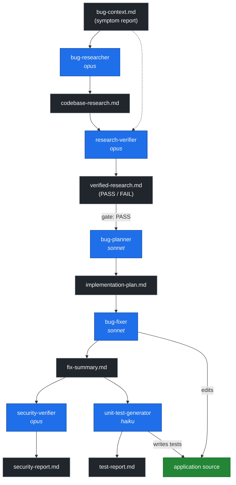

# 🤖 Homework 4: 6-Agent Pipeline

- **Student Name**: Andrii Gnatiuk
- **Date Submitted**: 08.06.2026
- **AI Tools Used**: Claude (Anthropic) via Cowork

---

## 📋 Project Overview

A **six-agent pipeline** that finds, fixes, security-reviews, and tests bugs in a small
Kotlin/Ktor sample application ("Snippet Vault") seeded with two functional bugs and one
security issue. The four graded agents from the assignment (Tasks 1–4) are the Research
Verifier, Bug Fixer, Security Verifier, and Unit Test Generator; two **custom feeder agents**
— the Bug Researcher and Bug Planner — were added to supply the inputs those agents consume,
so the pipeline runs end-to-end:

```
bug-researcher → research-verifier → bug-planner → bug-fixer → security-verifier → unit-test-generator
```

The whole chain runs via a single command (`./run-pipeline.sh`) over one bug or all bugs, with
least-privilege tools per agent and rich per-step logging.

See [ROADMAP.MD](ROADMAP.MD) for the phased implementation plan and [HOWTORUN.md](HOWTORUN.md)
for build/run commands.

## 🔗 Agent Communication

Each agent reads upstream artifacts and writes exactly one output, which becomes the next
agent's input. The Bug Planner is gated on the Research Verifier's PASS verdict.



After `bug-fixer`, the security review and test generation both consume `fix-summary.md` and
run independently. Only `bug-fixer` and `unit-test-generator` modify the application source.

## 🧩 Agent Models

Agents run in this order. `Custom` marks feeder agents introduced to complete the pipeline
(not among the four graded Tasks 1–4).

| Agent | Model | Custom | Justification |
|-------|-------|--------|---------------|
| `bug-researcher` | `claude-opus-4-6` | Yes | Research is graded on reference accuracy (every `file:line` must be exact). Off-by-a-line citations fail the verifier's gate and force reruns, so precise line attribution justifies the strongest model. (Sonnet runs produced correct snippets but off-by-two line numbers, capping quality at L2.) |
| `research-verifier` | `claude-opus-4-6` | No | Accuracy-critical gate: catching a fabricated reference or mismatched snippet here prevents a wrong fix downstream, so it uses the strongest reasoning model. |
| `bug-planner` | `claude-sonnet-4-6` | Yes | Turning a confirmed root cause into exact before/after edits is focused design over a small surface; sonnet gives reliable plan quality without top-tier cost. |
| `bug-fixer` | `claude-sonnet-4-6` | No | Analysis is already done; the work is mechanical (apply pre-specified edits, run tests). A balanced model gives reliable edits at lower cost — the task's "faster/cheaper for routine fixes." |
| `security-verifier` | `claude-opus-4-6` | No | Security review rewards deep, adversarial reasoning (timing side-channels, secret handling, missing-validation paths). A missed CRITICAL is the worst failure mode, so it uses the strongest model. |
| `unit-test-generator` | `claude-haiku-4-5` | No | Test scaffolding against an explicit target plus the FIRST checklist is the most routine, high-throughput step; a fast/cheap model fits, with the FIRST skill enforcing quality. |

Each agent also runs under a **least-privilege tool set** declared in its frontmatter — only
`bug-fixer` may edit source, only `bug-fixer`/`unit-test-generator` get shell access, and the
reviewers are otherwise read-only. See the tool-policy table in [HOWTORUN.md](HOWTORUN.md).

## 🛠️ Stack

Kotlin 2.3.20 / JVM 21, Gradle (Kotlin DSL), Ktor 3.4.3 (Netty), kotlinx.serialization,
kotlin-test-junit — per `.agents/docs/STACK.MD`.

## 🧪 Sample Application API

The pipeline operates on **Snippet Vault**, a minimal Ktor REST API that stores text snippets.
Write operations require an admin token in the `X-Api-Token` header; the expected token is read
from the `ADMIN_TOKEN` environment variable (the test suite sets it to `s3cr3t-admin-token`).

| Method | Path | Auth | Description |
|--------|------|------|-------------|
| `POST` | `/snippets` | `X-Api-Token` | Create a snippet (`title` 1–50 chars, `content` non-empty) |
| `GET` | `/snippets/{id}` | — | Retrieve a snippet by id |
| `GET` | `/snippets?q=<query>` | — | Search by title (case-insensitive) |
| `GET` | `/swagger` | — | Swagger UI |
| `GET` | `/openapi.yaml` | — | Raw OpenAPI spec |

Responses use a single error shape: `{ "errors": [ { "field": ..., "message": ... } ] }`.
Status codes: `201` created, `200` ok, `400` validation error, `401` unauthorized, `404` not found.

### Examples

```bash
# Create (requires the token)
curl -s -X POST localhost:8080/snippets \
  -H "X-Api-Token: $ADMIN_TOKEN" \
  -H "Content-Type: application/json" \
  -d '{"title":"Hello","content":"world"}'
# → 201 {"id":1,"title":"Hello","content":"world"}

# Retrieve by id
curl -s localhost:8080/snippets/1
# → 200 {"id":1,"title":"Hello","content":"world"}

# Search by title (case-insensitive)
curl -s "localhost:8080/snippets?q=hello"
# → 200 [{"id":1,"title":"Hello","content":"world"}]

# Missing/invalid token
curl -s -o /dev/null -w '%{http_code}\n' -X POST localhost:8080/snippets \
  -H "Content-Type: application/json" -d '{"title":"x","content":"y"}'
# → 401
```

### Seeded issues (the pipeline's subject)

The app ships with three intentional defects (see `context/bugs/`): an off-by-one in title
length validation, a case-sensitive search, and an admin-token authorization weakness
(hardcoded secret + non-constant-time comparison). These are what the agents find, fix, and
test — the source in this folder reflects the **post-pipeline** state once fixes are applied.

## 📁 Project Structure

```
homework-4/
├── README.md                     # this file
├── HOWTORUN.md                   # build / run / pipeline commands
├── ROADMAP.MD                    # phased implementation plan
├── TASKS.md                      # assignment (read-only)
├── build.gradle.kts              # subproject build
├── run-pipeline.sh               # single-command orchestrator (all / one-by-one / interactive)
│
├── agents/                       # the six agent definitions + runner adapter
│   ├── bug-researcher.agent.md
│   ├── research-verifier.agent.md
│   ├── bug-planner.agent.md
│   ├── bug-fixer.agent.md
│   ├── security-verifier.agent.md
│   ├── unit-test-generator.agent.md
│   └── run-agent.sh              # composes prompt, loads skills, enforces per-agent tools
│
├── skills/
│   ├── research-quality-measurement.md   # quality levels + verified-research.md format
│   └── unit-tests-FIRST.md               # FIRST principles for generated tests
│
├── context/bugs/<00x-type-desc>/ # one folder per seeded bug
│   ├── bug-context.md                    # symptom report (input)
│   ├── research/
│   │   ├── codebase-research.md           # bug-researcher output
│   │   └── verified-research.md           # research-verifier output (PASS/FAIL)
│   ├── implementation-plan.md            # bug-planner output
│   ├── fix-summary.md                    # bug-fixer output
│   ├── security-report.md               # security-verifier output
│   └── test-report.md                    # unit-test-generator output
│
├── src/
│   ├── main/kotlin/homework4/
│   │   ├── entrypoint/   (Main.kt, Module.kt)
│   │   ├── routing/      (SnippetRoutes.kt, DocumentationRoutes.kt)
│   │   ├── service/      (SnippetService.kt)
│   │   ├── models/       (Snippet.kt, ApiModels.kt)
│   │   ├── validation/   (SnippetValidator.kt)
│   │   └── utils/        (TokenAuth.kt)
│   ├── main/resources/   (openapi.yaml)
│   └── test/kotlin/homework4/   # unit + integration tests
│
└── docs/
    ├── logs/             # pipeline run logs + composed agent prompts
    └── screenshots/      # evidence: pipeline run, fixes, security scan, tests
```
